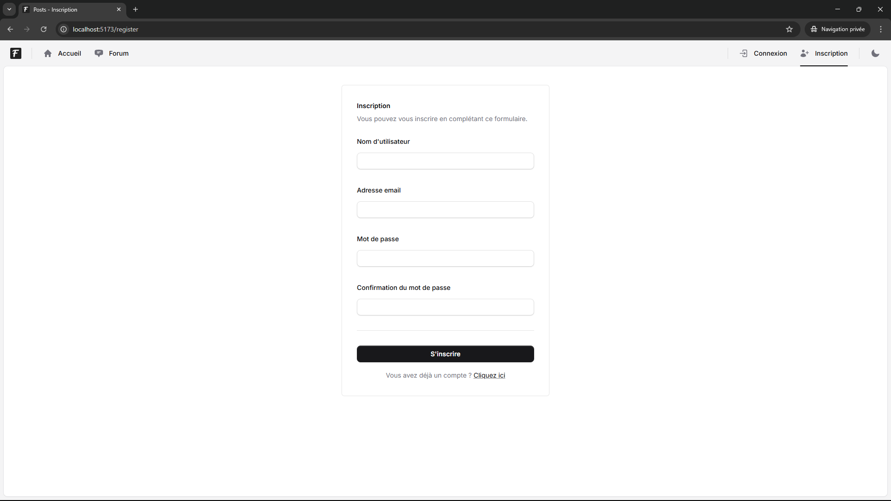
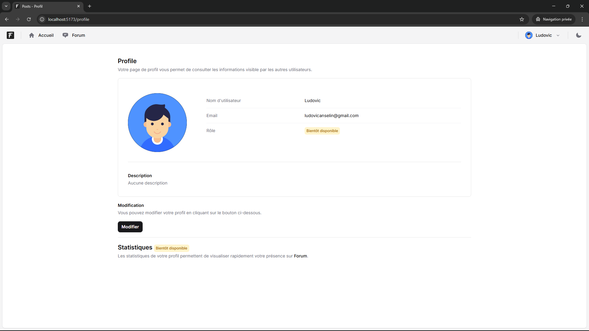
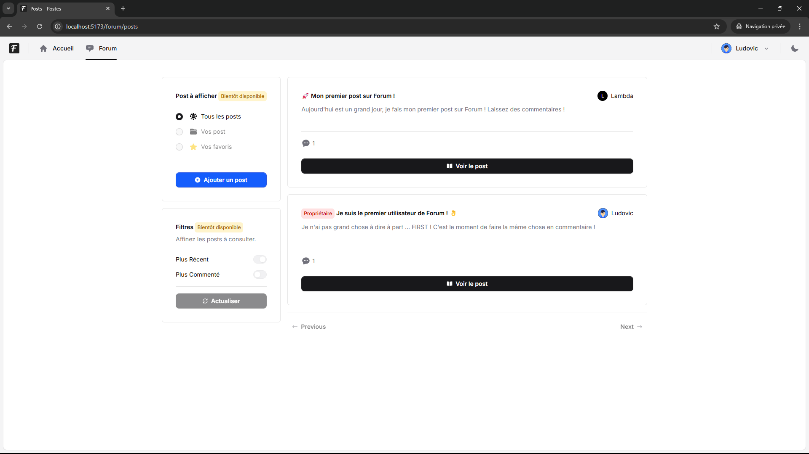
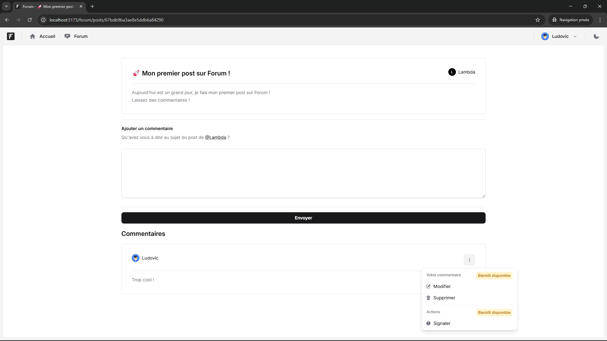

# Présentation de l'Application

Cette application offre une plateforme interactive permettant de créer, lire, mettre à jour, et supprimer des posts, tout en facilitant l'inscription et la connexion des utilisateurs.

## ✨ Aperçu des principales fonctionnalités

Voici quelques captures d'écrans pour mieux visualiser les interfaces et les principales fonctionnalités de l'application.

### 1. Page d'inscription

Interface permettant aux utilisateurs de s'inscrire avec leurs informations personnelles.



---

### 2. Page de profil

Vue de la page de profil de l'utilisateur, où ce dernier peut voir et gérer ses informations.



---

### 3. Page des posts

Page principale listant tous les posts créés par les utilisateurs.



---

### 4. Page d'un post individuel

Interface montrant le détail d'un post spécifique.



---

## Configuration des variables d'environnement

Ce projet utilise des fichiers `.env` pour configurer certaines parties de l'application : une pour le **client** (Frontend) et une pour le **serveur** (Backend).
Ces fichiers doivent être créés à la racine des répertoires respectifs. Voici les détails des variables nécessaires et leurs valeurs attendues.

---

## ⚙️ Fichier `.env` du client

Créez un fichier `.env` à la racine du projet **client**. Vous devez spécifier l'URL où l'API backend est hébergée. Voici un exemple de variable à inclure :

```env
VITE_BACKEND_HOST=http://localhost:3000/
```

- **`VITE_BACKEND_HOST`** : L'URL correspondant à votre serveur backend. Par défaut, en mode local, utilisez `http://localhost:3000/`.

---

## ⚙️ Fichier `.env` du serveur

Créez un fichier `.env` à la racine du projet **serveur**. Les variables suivantes doivent être renseignées :

### Serveur

```env
APP_PORT=3000
```

- **`APP_PORT`** : Le port sur lequel le serveur backend doit fonctionner. Par défaut, `3000`.

---

### Base de données MongoDB

```env
MONGODB_PROTOCOL="mongodb"
MONGODB_HOST="localhost"
MONGODB_PORT=27017
MONGODB_DATABASE="forum-react-project"
MONGODB_USERNAME=root
MONGODB_PASSWORD=root
MONGODB_AUTH_SOURCE=admin
```

- **`MONGODB_PROTOCOL`** : Protocole MongoDB (exemple : `mongodb`).
- **`MONGODB_HOST`** : Hôte où MongoDB est en cours d'exécution (par défaut : `localhost`).
- **`MONGODB_PORT`** : Port pour accéder à votre instance MongoDB (par défaut : `27017`).
- **`MONGODB_DATABASE`** : Nom de la base de données utilisée par l'application.
- **`MONGODB_USERNAME`** : Nom d'utilisateur pour l'authentification à votre base de données MongoDB.
- **`MONGODB_PASSWORD`** : Mot de passe pour l'authentification à MongoDB.
- **`MONGODB_AUTH_SOURCE`** : Source de l'authentification MongoDB (par défaut : `admin`).

---

### Authentification des utilisateurs

```env
USER_AUTH_SECRET_KEY=ShF9lGxET8iZ3arwmnRYztUyTxaVgiF3aUbLF4f74ZEZTdt14FtNlXdoD4bh7Ttw
USER_AUTH_EXPIRES_IN=86400000
USER_AUTH_EXPIRES_IN_REMEMBER=604800000
```

- **`USER_AUTH_SECRET_KEY`** : Clé secrète utilisée pour signer les tokens JWT. Il est important de garder cette clé sécurisée.
- **`USER_AUTH_EXPIRES_IN`** : Durée d'expiration des tokens JWT en millisecondes. Par exemple, `86400000` correspond à 1 jour.
- **`USER_AUTH_EXPIRES_IN_REMEMBER`** : Durée d'expiration des tokens JWT en millisecondes lorsque l'option "Se souvenir de moi" est coché.
